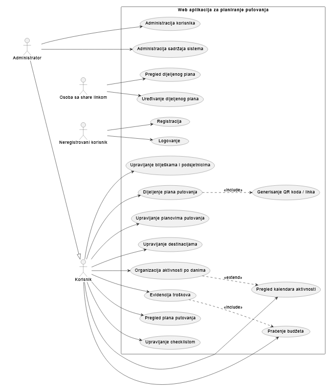

<p align="center">
  
</p>

<p align="center">
  
</p>

<p align="center">
  
  
  
  
  
</p>

---

# Travel Planner

Travel Planner je web aplikacija za planiranje putovanja. Projekat je radjen za predmet **Primena veb programiranja u infrastrukturnim sistemima**.

Ideja aplikacije je da korisnik na jednom mjestu moze da napravi plan putovanja i uz njega vodi destinacije, aktivnosti, troskove, checklistu, biljeske i podsjetnike. Plan se moze podijeliti preko linka ili QR koda.

## Funkcionalnosti

- registracija i logovanje korisnika
- kreiranje, izmjena i brisanje planova putovanja
- dodavanje destinacija za jedno putovanje
- organizacija aktivnosti po danima
- pregled aktivnosti kroz kalendar
- evidencija troskova i pracenje budzeta
- checklist stavke za putovanje
- biljeske i podsjetnici
- dijeljenje plana preko linka i QR koda
- admin pregled korisnika i sadrzaja

Use case dijagram je dodat u fajlu:



## Arhitektura

Aplikacija je podijeljena na frontend, backend servise i bazu podataka.

- **Frontend** je React aplikacija. Sluzi za korisnicki interfejs i salje zahtjeve backend-u.
- **Backend** je napravljen u .NET-u kroz Service Fabric servise. Tu se nalazi poslovna logika, validacija i rad sa podacima.
- **SQL Server** cuva podatke aplikacije.

Frontend ne pristupa bazi direktno. Komunikacija ide ovako:

```text
React frontend -> ApiGatewayService -> interni servisi -> SQL Server
```

Backend servisi:

- `ApiGatewayService` - prima HTTP zahtjeve sa frontenda
- `IdentityService` - registracija, login, korisnici i role
- `TripPlanningService` - planovi, destinacije, aktivnosti, checklist, biljeske i podsjetnici
- `BudgetService` - troskovi i budzet
- `SharingService` - dijeljenje plana preko tokena/linka

## Baza podataka

Za bazu se koristi SQL Server. Entity Framework Core je koristen za `DbContext` i migracije.

Persistence sloj je izdvojen u:

```text
backend/TravelPlanner.Persistence
```

U tom projektu se nalaze entity klase, `TravelPlannerDbContext` i migracije. Connection string se podesava u Service Fabric parametrima, npr. u:

```text
backend/TravelPlanner/ApplicationParameters/Local.1Node.xml
backend/TravelPlanner/ApplicationParameters/Local.5Node.xml
```

## Struktura projekta

```text
pugs_projekat/
|-- backend/
|   |-- ApiGatewayService/
|   |-- IdentityService/
|   |-- TripPlanningService/
|   |-- BudgetService/
|   |-- SharingService/
|   |-- Contracts/
|   |-- TravelPlanner.Persistence/
|   |-- TravelPlanner/
|   `-- TravelPlanner.sln
|
|-- frontend/
|   |-- src/
|   |-- package.json
|   `-- .env
|
|-- usecase.png
`-- README.md
```

## Pokretanje projekta

Potrebno je imati Visual Studio sa Service Fabric alatima, .NET 8 SDK, SQL Server, Node.js i npm.

Prvo pokrenuti SQL Server i primijeniti migracije:

```powershell
dotnet tool restore
dotnet dotnet-ef database update --project backend/TravelPlanner.Persistence --startup-project backend/TravelPlanner.Persistence --context TravelPlannerDbContext
```

Zatim otvoriti backend solution:

```text
backend/TravelPlanner.sln
```

U `Local.1Node.xml` ili `Local.5Node.xml` provjeriti connection string i JWT vrijednosti, pa pokrenuti Service Fabric aplikaciju iz Visual Studio okruzenja.

Frontend se pokrece iz foldera `frontend`:

```powershell
npm install
npm run dev
```

Frontend se lokalno otvara na:

```text
http://localhost:5173
```

Backend adresa za frontend je u fajlu:

```text
frontend/.env
```

## Test nalog

Migracije dodaju osnovne role. Ako u bazi ne postoji admin, kreira se pocetni admin nalog:

```text
login: admin
email: admin@travelplanner.local
lozinka: admin123
```

Za stvarnu upotrebu ove vrijednosti treba promijeniti.

<p align="center">
  
</p>
