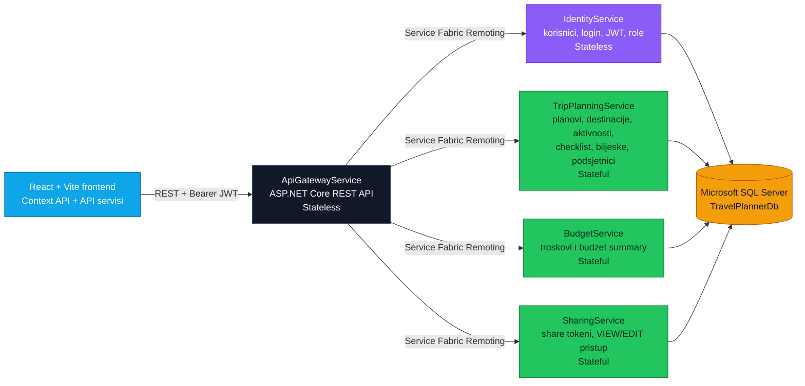

<p align="center">
  
</p>

<p align="center">
  
</p>

<p align="center">
  
  
  
  
  
  
</p>

<p align="center">
  <a href="#pregled">Pregled</a> |
  <a href="#funkcionalnosti">Funkcionalnosti</a> |
  <a href="#arhitektura-sistema">Arhitektura</a> |
  <a href="#pokretanje-projekta">Pokretanje</a> |
  <a href="#sql-migracije">SQL migracije</a> |
  <a href="#status-specifikacije">Status specifikacije</a>
</p>

---

## Pregled

**Travel Planner** je web aplikacija za planiranje putovanja razvijena za predmet **Primena veb programiranja u infrastrukturnim sistemima**.

Aplikacija pomaze korisniku da na jednom mjestu organizuje:

- osnovne podatke o putovanju,
- destinacije i datume boravka,
- dnevne aktivnosti kroz pregled i calendar view,
- troskove, kategorije i preostali budzet,
- checklist / packing listu,
- biljeske i podsjetnike,
- dijeljenje plana putem linka i QR koda.

Centralni entitet sistema je **plan putovanja**. Oko njega su organizovani destinacije, aktivnosti, troskovi, budzet, biljeske, podsjetnici, checklist stavke i share tokeni.

---

## Funkcionalnosti

| Modul | Sta sistem podrzava |
| --- | --- |
| **Autentifikacija** | Registracija, logovanje, JWT tokeni, hashovane lozinke i role `User` / `Admin`. |
| **Planovi putovanja** | Kreiranje, pregled, izmjena i brisanje planova sa nazivom, opisom, datumima, budzetom i napomenama. |
| **Destinacije** | Dodavanje vise destinacija po putovanju, sa lokacijom, datumima dolaska/odlaska i opisom. |
| **Aktivnosti** | Organizacija po danima, vrijeme, lokacija, status, opis i procijenjeni trosak. |
| **Kalendar** | Prikaz aktivnosti kroz FullCalendar pregled radi lakse navigacije po danima. |
| **Troskovi i budzet** | Kategorije troskova, automatski zbir troskova i prikaz preostalog budzeta. |
| **Checklist** | Packing lista i obaveze prije puta, uz oznacavanje zavrsenih stavki. |
| **Biljeske i podsjetnici** | Dodatne informacije i podsjetnici vezani za konkretan plan putovanja. |
| **Dijeljenje** | Share link i QR kod sa nivoima pristupa `VIEW` i `EDIT`. |
| **Admin panel** | Pregled korisnika, upravljanje ulogama i administracija sadrzaja sistema. |
| **Izvjestaj** | Print/PDF-friendly pregled plana putovanja kroz browser print funkcionalnost. |

---

## Tehnoloski Stack

| Sloj | Tehnologije |
| --- | --- |
| **Frontend** | React 19, Vite 7, React Router, Context API, FullCalendar, qrcode.react, lucide-react |
| **Backend** | .NET 8, ASP.NET Core Web API, Microsoft Service Fabric, Service Fabric Remoting |
| **Baza** | Microsoft SQL Server, SQL migracije |
| **Sigurnost** | JWT autentifikacija, role-based access, PBKDF2 password hashing |
| **Integracija** | REST API preko `ApiGatewayService`, interna komunikacija preko Service Fabric Remoting-a |

---

## Arhitektura Sistema



### Mikroservisi

| Servis | Tip | Odgovornost |
| --- | --- | --- |
| `ApiGatewayService` | Stateless | Jedini HTTP ulaz za frontend, REST kontroleri, CORS, JWT validacija i pozivanje internih servisa. |
| `IdentityService` | Stateless | Registracija, login, hashovanje lozinki, JWT izdavanje, korisnici i role. |
| `TripPlanningService` | Stateful | Planovi putovanja, destinacije, aktivnosti, checklist, biljeske i podsjetnici. |
| `BudgetService` | Stateful | Evidencija troskova i automatski obracun ukupnog/preostalog budzeta. |
| `SharingService` | Stateful | Kreiranje i validacija share tokena, QR/link dijeljenje, `VIEW` i `EDIT` pristup. |

---

## Struktura Projekta

```text
pugs_projekat/
|-- backend/
|   |-- ApiGatewayService/       # REST API za frontend
|   |-- IdentityService/         # autentifikacija, korisnici, role
|   |-- TripPlanningService/     # planovi, destinacije, aktivnosti, checklist, notes, reminders
|   |-- BudgetService/           # troskovi i budzet
|   |-- SharingService/          # share tokeni i javni/shared pristup
|   |-- Contracts/               # DTO modeli i Service Fabric Remoting interfejsi
|   |-- database/                # SQL skripte i migracije
|   |-- TravelPlanner/           # Service Fabric application project
|   `-- TravelPlanner.sln
|
|-- frontend/
|   |-- src/
|   |   |-- api/                 # HTTP servisi prema backend-u
|   |   |-- components/          # reusable React komponente
|   |   |-- context/             # AuthContext i AppContext
|   |   |-- models/              # frontend modeli i konstante
|   |   |-- pages/               # rute/stranice aplikacije
|   |   |-- routes/              # React Router konfiguracija
|   |   |-- styles/              # globalni stilovi
|   |   `-- utils/               # validacija i token storage
|   |-- .env                     # VITE_API_BASE_URL
|   |-- package.json
|   `-- index.html
|
`-- README.md
```

---

## Frontend Organizacija

Frontend je organizovan kao moderna React aplikacija:

- stranice su u `frontend/src/pages`,
- reusable UI cjeline su u `frontend/src/components`,
- globalno stanje i tok autentifikacije su u `frontend/src/context`,
- HTTP pozivi su izdvojeni u `frontend/src/api`,
- frontend modeli i konstante su u `frontend/src/models`,
- URL backend-a se cita iz `.env` fajla kroz `VITE_API_BASE_URL`.

HTTP pozivi se ne rade direktno iz komponenti. Komponente koriste servisne funkcije i context sloj, sto olaksava testiranje, odrzavanje i zamjenu backend URL-a.

### Frontend `.env`

```env
VITE_API_BASE_URL=http://localhost:8080
```

Ako `ApiGatewayService` dobije drugi HTTP endpoint u lokalnom Service Fabric cluster-u, ovu vrijednost treba uskladiti sa stvarnim URL-om gateway servisa.

---

## Backend Organizacija

Backend je implementiran kroz Microsoft Service Fabric aplikaciju sa jasno odvojenim logickim servisima.

Vanjski HTTP zahtjevi idu kroz:

```text
frontend -> ApiGatewayService -> Service Fabric Remoting -> interni servisi -> SQL Server
```

DTO modeli su smjesteni u `backend/Contracts`, dok svaki servis ima svoje modele baze u `Models` folderima. Mapiranje izmedju DTO i DB modela radi se u backend sloju, tako da ugovori API-ja i perzistentni modeli ostaju odvojeni.

---

## REST Resursi

Glavni REST endpoint-i prate konvenciju imenovanja resursa:

| Resurs | Primjer |
| --- | --- |
| Sesije | `POST /api/sessions` |
| Korisnici | `POST /api/users`, `GET /api/users/me` |
| Planovi putovanja | `GET /api/trip-plans`, `POST /api/trip-plans` |
| Pojedinacni plan | `GET /api/trip-plans/{tripPlanId}` |
| Destinacije | `/api/trip-plans/{tripPlanId}/destinations` |
| Aktivnosti | `/api/trip-plans/{tripPlanId}/activities` |
| Troskovi | `/api/trip-plans/{tripPlanId}/expenses` |
| Budzet | `GET /api/trip-plans/{tripPlanId}/budget` |
| Checklist | `/api/trip-plans/{tripPlanId}/checklist-items` |
| Biljeske | `/api/trip-plans/{tripPlanId}/notes` |
| Podsjetnici | `/api/trip-plans/{tripPlanId}/reminders` |
| Share tokeni | `/api/trip-plans/{tripPlanId}/shares` |
| Shared plan | `/api/shares/{token}/trip-plan` |
| Admin | `/api/admin/trip-plans` |

---

## Sigurnost I Validacija

Sistem vodi racuna o osnovnim sigurnosnim pravilima:

- lozinke se cuvaju kao hash, uz PBKDF2 i SHA-256,
- JWT tokeni imaju potpis, issuer, audience i istek,
- `ApiGatewayService` validira token prije pristupa zasticenim rutama,
- korisnik moze upravljati samo svojim planovima,
- admin ima dodatna ovlascenja za korisnike i sadrzaj,
- share token se validira na svakom zahtjevu,
- `VIEW` token omogucava samo pregled,
- `EDIT` token dozvoljava izmjene nad podrzanim entitetima,
- datumi i budzet imaju backend i SQL validacije,
- brisanje plana uklanja povezane entitete preko cascade veza.

---

## SQL Migracije

Migracije se nalaze u `backend/database/migrations`.

Za lokalni development najjednostavnije je pokrenuti objedinjenu skriptu:

```text
backend/database/01_run_all_migrations.sql
```

Skripta kreira bazu `TravelPlannerDb`, tabele, role i bootstrap admin nalog ako u sistemu ne postoji nijedan admin.

Ako se migracije pokrecu rucno, preporuceni redosled je:

1. `backend/database/migrations/identity/001_create_identity_schema.sql`
2. `backend/database/migrations/trip-planning/001_create_trip_planning_schema.sql`
3. `backend/database/migrations/trip-planning/002_create_checklist_items.sql`
4. `backend/database/migrations/trip-planning/003_create_notes.sql`
5. `backend/database/migrations/trip-planning/004_create_reminders.sql`
6. `backend/database/migrations/trip-planning/005_add_trip_plan_owner_cascade.sql`
7. `backend/database/migrations/trip-planning/006_add_required_date_checks.sql`
8. `backend/database/migrations/budget/001_create_budget_schema.sql`
9. `backend/database/migrations/sharing/001_create_share_tokens.sql`

Lokalni connection string koji koriste Service Fabric parametri:

```text
Server=localhost;Database=TravelPlannerDb;Trusted_Connection=True;TrustServerCertificate=True;
```

Ako je lokalni SQL Server named instance `SQLEXPRESS`, koristiti:

```text
Server=localhost\SQLEXPRESS;Database=TravelPlannerDb;Trusted_Connection=True;TrustServerCertificate=True;
```

---

## Pokretanje Projekta

### Preduslovi

- Windows razvojno okruzenje
- Visual Studio sa Service Fabric alatima
- Microsoft Service Fabric SDK i lokalni cluster
- .NET 8 SDK
- Microsoft SQL Server i SQL Server Management Studio
- Node.js i npm

### 1. Baza

U SQL Server Management Studio otvoriti i pokrenuti:

```text
backend/database/01_run_all_migrations.sql
```

Nakon toga baza `TravelPlannerDb` treba da sadrzi sve potrebne seme, tabele, constraint-e i pocetne role.

### 2. Backend

Otvoriti solution:

```text
backend/TravelPlanner.sln
```

U Service Fabric parametrima podesiti:

```text
backend/TravelPlanner/ApplicationParameters/Local.1Node.xml
backend/TravelPlanner/ApplicationParameters/Local.5Node.xml
```

Najbitniji parametri:

```text
Identity_DefaultConnection
TripPlanning_DefaultConnection
Budget_DefaultConnection
Sharing_DefaultConnection
Identity_JwtSecret
ApiGateway_JwtSecret
Identity_JwtIssuer
ApiGateway_JwtIssuer
Identity_JwtAudience
ApiGateway_JwtAudience
ApiGateway_CorsAllowedOrigins
```

JWT vrijednosti za `IdentityService` i `ApiGatewayService` moraju biti iste, jer identity servis izdaje token, a gateway servis ga validira.

`JwtSecret` mora imati najmanje 32 bajta/karaktera.

Zatim pokrenuti/deploy-ovati Service Fabric aplikaciju `TravelPlanner` iz Visual Studio okruzenja.

### 3. Frontend

```powershell
cd frontend
npm install
npm run dev
```

Vite aplikacija se podrazumijevano pokrece na:

```text
http://localhost:5173
```

Za provjeru produkcionog build-a:

```powershell
cd frontend
npm run build
npm run preview
```

---

## Test Nalog

Migracije seed-uju role `User` i `Admin`. Ako u bazi ne postoji nijedan admin, kreira se bootstrap admin:

```text
login: admin
email: admin@travelplanner.local
lozinka: admin123
```

Za stvarno okruzenje potrebno je promijeniti lozinku i zamijeniti sve `CHANGE_ME_*` konfiguracione vrijednosti.

---

## Dijeljenje Plana

Dijeljenje plana podrzava dva nivoa pristupa:

| Pristup | Mogucnosti |
| --- | --- |
| `VIEW` | Pregled plana, destinacija, aktivnosti, troskova, checklist stavki, biljeski i podsjetnika. |
| `EDIT` | Izmjena podrzanih podataka nad dijeljenim planom. |

Frontend generise QR kod za share link preko `qrcode.react`, dok backend validira token i nivo pristupa pri svakom zahtjevu.

---

## Status Specifikacije

| Zahtjev | Status |
| --- | --- |
| React frontend | Implementirano |
| Upravljanje stanjem aplikacije | Implementirano kroz Context API |
| HTTP pozivi izdvojeni u servise | Implementirano u `frontend/src/api` |
| URL backend-a u `.env` fajlu | Implementirano kroz `VITE_API_BASE_URL` |
| Frontend modeli | Implementirano u `frontend/src/models` |
| Service Fabric mikroservisi | Implementirano |
| Stateless i stateful servisi | Implementirano |
| SQL Server perzistencija | Implementirano |
| SQL migracije | Implementirano |
| DTO i DB modeli odvojeni | Implementirano |
| REST imenovanje resursa | Implementirano |
| Hashovanje lozinki | Implementirano |
| Validacija potpisa i isteka tokena | Implementirano |
| Validacija datuma i budzeta | Implementirano |
| Cascade brisanje povezanih entiteta | Implementirano |
| QR/share pristup `VIEW` i `EDIT` | Implementirano |
| README uputstvo za pokretanje | Implementirano |
| Use Case dijagram | Bice dodat naknadno |

---

## Korisni Fajlovi

| Fajl | Namjena |
| --- | --- |
| `backend/TravelPlanner.sln` | Backend solution za Visual Studio |
| `backend/TravelPlanner/ApplicationPackageRoot/ApplicationManifest.xml` | Glavni Service Fabric manifest |
| `backend/TravelPlanner/StartupServices.xml` | Definicija stateless/stateful servisa |
| `backend/database/01_run_all_migrations.sql` | Objedinjena SQL migracija |
| `backend/database/README.md` | Dodatne napomene za bazu |
| `frontend/package.json` | Frontend skripte i dependency lista |
| `frontend/.env` | Backend URL za frontend |

---

## Kratka Komanda Za Frontend

```powershell
cd frontend
npm install
npm run dev
```

## Kratak Redosled Za Cist Start

1. Pokrenuti SQL Server.
2. Pokrenuti `backend/database/01_run_all_migrations.sql`.
3. Provjeriti Service Fabric parametre u `Local.1Node.xml` ili `Local.5Node.xml`.
4. Pokrenuti `backend/TravelPlanner.sln` kroz Visual Studio.
5. Provjeriti `frontend/.env` i `VITE_API_BASE_URL`.
6. Pokrenuti frontend sa `npm run dev`.
7. Otvoriti `http://localhost:5173`.

<p align="center">
  
</p>
